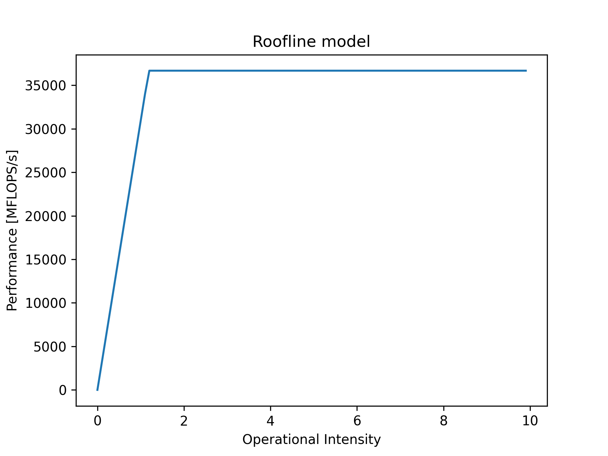

# Benchmarks 

Machine utilisée pour les tests : 

- Architecture : Intel x86_64
- CPU : i9-9900K 8 Cores / 16 Threads @ 3.60GHz / Turbo @ 5.00GHz (CoffeeLake)
  - Cache L1 : 32 kB
  - Cache L2 : 256 kB
  - Cache L3 : 16 MB
- OS: Debian 12
- Compilateur : 
    - gcc 12.2.0
    - target: x86_64-linux-gnu
    - Flags de compilation: `-O3 -g -Wall -fno-inline -DLIKWID_PERFMON`
    - Librairies: `stb`, `math.h` et `Likwid`

\clearpage

# Roofline

## Benchmark

On utilise `likwid-bench` avec le type `peakflops`, c'est le type le plus pertinent car on ne vectorise pas encore les opérations et  pour le moment on part du principe qu'on utilisera des nombres à virgules flottantes double-précision.

Pour chaque coeur on dédie 32kB de cache, ainsi pour le benchmark on précisera une taille de cache de $8\times32\ \text{kB} = 256\ \text{kB}$. 

Pour mesurer le pic de performances on utilise alors la commande :

```
likwid-bench -t peakflops -W N:256KB:8
```

On obtient le résultat de **36684 MFlops/s**

Pour obtenir le throughput maximal on utilise de nouveau `likwid-bench` mais avec un benchmark de type `load`, la commande utilisée est la suivante :

```
likwid-bench -t load -W N:2GB:8
```

On obtient le résultat de **30916 MByte/s**

{ width=50% }

\clearpage

# Analyse du code 

Dans cette première partie, il est question de trouver emplacements dans le code qui prennent le plus de temps à calculer. J'ai identifié plusieurs endroits dans le code demandant des performances : 

- Filtre niveau de gris (listes chaînées et tableaux 1D): `grayscale_1d` et `grayscale_chained`
- Filtre gaussien (listes chaînées et tableaux 1D): `gaussian_1d` et `gaussian_chained`
- Filtre sobel  (listes chaînées et tableaux 1D): `sobel_1d` et `sobel_chained`

Précisément pour les versions avec les tableaux 1D on prend uniquement en compte le calcul de la convolution et pour les listes chaînées on prend en compte quand même le remplissage du cache.

Exemple : 

\Begin{multicols}{2}
```c
	LIKWID_MARKER_START("gaussian_chained");
	for (i = 0; i < img_size; ++i) {
        // populate cache    
	}

    // ...

	for (i = width; i < img_size - width; ++i) {
        // apply convolution
	}
	LIKWID_MARKER_STOP("gaussian_chained");
```

\columnbreak

```c
	LIKWID_MARKER_START("gaussian_1d");
	for (i = width; i < img_size - width; ++i) {
        // apply convolution
    }
	LIKWID_MARKER_STOP("gaussian_1d");
```

\End{multicols}

En effectuant un benchmark avec likwid voici les résultats obtenus pour les listes chaînées: 

- Temps d'exécution total : 0.325850 secondes
- Commande exécutée : 

`sudo likwid-perfctr -C E:N:8 -g MEM_DP -m ./lab01 ../images/half-life.png ../images/out.png 2`

|                     | Temps d'exécution [s] | MFLOPs/s | Operational Intensity | Instructions exécutées |
|---------------------|-----------------------|----------|-----------------------|------------------------|
| `grayscale_chained` | 0.086963 (26%)        | 144.1993 | 0.0152                | 100390200              |
| `gaussian_chained`  | 0.141852 (43%)        | 0.0001   | 1.336258e-08          | 392485400              |
| `sobel_chained`     | 0.095893 (29%)        | 43.5051  | 0.0035                | 542597600              |

Voici le résultat pour les tableaux 1D

- Temps d'exécution total : 0.117468 secondes
- Commande exécutée : 

`sudo likwid-perfctr -C E:N:8 -g MEM_DP -m ./lab01 ../images/half-life.png ../images/out.png 1`

 
|                | Temps d'exécution [s] | MFLOP/s  | Operational Intensity | Instructions exécutées |
|----------------|-----------------------|----------|-----------------------|------------------------|
| `grayscale_1d` | 0.030708 (26%)        | 144.1993 | 0.5390                | 129585900              |
| `gaussian_1d`  | 0.038637 (32%)        | 0.0001   | 1.172069e-06          | 288068300              |
| `sobel_1d`     | 0.047003 (40%)        | 88.7568  | 1.544869e-06          | 425737400              |

Les bottlenecks principaux sont les calculs de convolution comme on peut le constater, à noter que les temps d'exécution ne sont pas nécessairement pertinents étant donné qu'on ne lance qu'une seule fois le test.

\clearpage

# Amélioration des performances

## Baseline

Voici ci-dessous un tableau récapitulatif des tests effectués ainsi qu'un graphe des temps de traitements mesurés pour chacun des tests.

Images d'entrées : 

| Nom du fichier  | Dimensions [pixels]          | Nombre de composantes par pixel |
|-----------------|------------------------------|---------------------------------|
| `half-life.png` | $2000 \times 2090 = 4038000$ | 3 (8-bit RGB)                   |
| `medalion.png`  | $1267 \times 919 = 1164373$  | 3 (8-bit RGB)                   |
| `nyc.png`       | $1150 \times 710 = 816500$   | 3 (8-bit RGB)                   |

Nombre de type : 

- Tableau 1D : `1`
- Liste chaînée : `2`

Sur la base de ces deux variables (l'image et le type de structures de données) une matrice de tests a été effectuée. Chaque test est effectué 50 fois et le résultat gardé est la moyenne de toutes les runs.

{width=60%}

## Accélération du calcul de la norme du gradient

Lorsqu'on applique le filtre sobel sur l'image on effectue en chaque point de l'image une convolution permettant d'approximer les gradients horizontaux ($\bm{G_x}$) et verticaux ($\bm{G_y}$). 

Une fois les gradients calculés, on peut obtenir une approximation de la norme euclidienne du gradient :

$$\bm{G} = \sqrt{\bm{G_x}^2 + \bm{G_y}^2}$$

Ce dernier calcul est ensuite utilisé pour déterminer si la norme est plus grande qu'un certain seuil, selon les cas on affiche un pixel blanc ou noir.

Le calcul de la norme peut être simplifié en comparant simplement les distances au carré : 

$$\text{Couleur} = \begin{cases}
    \text{blanc},\qquad & \text{si } \bm{G}^2 > \text{seuil} \times \text{seuil},\\
    \text{noir},\qquad  & \text{sinon}
\end{cases}$$

Le code modifié résultant est le suivant :

```c
    magnitude = gx * gx + gy * gy;
    res_img->data[i] = magnitude > SOBEL_BINARY_THRESHOLD ? PIXEL_WHITE : PIXEL_BLACK
```

La principale différence observée est que comme nous n'utilisons plus de racine carrée, la fonction n'utilise plus d'opérations avec des nombres à virgules flottantes.

# Optimisation des boucles `for`

- Optimisation de la boucle
  - Pas de passage sur les pixels des bords inférieurs et supérieurs lors de l'application des filtres
Code modifiée de la manière suivante :

```c
for (i = width; i < img_size - width; ++i) {
    // ...
}
```
  - Simplification de la vérification si un pixel est en bordure (on ne vérifie plus que les bords latéraux)
Code modifiée de la manière suivante :

```c
if (position % width == 0 || position % width == width - 1) {
    // on border
}
```

- Précalcule des offsets pour les convolutions:
```c
// ...
const int32_t offsets[] = {-width - 1, -width, -width + 1, -1, 0, 1, width - 1, width, width + 1}
// ...
sum = 0;
for (j = 0; j < 9; ++j) {
    sum += img->data[i + offsets[j]] * kernel[j];
}
res_img->data[i] = sum / gauss_ponderation;
//...
```

- Retrait des autres invariants des boucles `for`:
  - Taille et dimensions de l'image
- Loop unrolling des convolutions avec offsets précalculés.

Résultats obtenus (temps d'exécution omis car pas forcément pertinent) : 


|                     | MFLOPs/s | Operational Intensity | Instructions exécutées                  |
|---------------------|----------|-----------------------|-----------------------------------------|
| `grayscale_chained` | 246.7150 | 0.0255                | 92030240  (\textcolor{cgreen}{-8.3\%})  |
| `gaussian_chained`  | 0.0001   | 1.179036e-08          | 317241800 (\textcolor{cgreen}{-19.2\%}) |
| `sobel_chained`     | 0.0001   | 9.531865e-09          | 471561400 (\textcolor{cgreen}{-13.2\%}) |
| `grayscale_1d`      | 437.9652 | 0.5388                | 108685900 (\textcolor{cgreen}{-16.1\%}) |
| `gaussian_1d`       | 0.0005   | 3.234571e-06          | 229511800 (\textcolor{cgreen}{-20.3\%}) |
| `sobel_1d`          | 0.0004   | 2.475272e-06          | 358851900 (\textcolor{cgreen}{-15.7\%}) |

On constate d'abord une forte baisse de MFLOP/s, c'est attendu étant donné que nous travaillons qu'avec des entiers lors des convolutions. 

Par rapport à la baseline, on constate également une réduction du nombre d'instructions exécutée pour le même calcul (à savoir que le test à été effectuée sur la même image)


# Améliorations futures 

## Parallélisation du traitement d'image

Afin d'appliquer les convolutions on peut séparer le traitement dans plusieurs threads afin de paralléliser le calcul de la convolution. En effet ce calcul peut être fait indépendamment de l'état des autres threads en cours d'exécution et ainsi on peut accélérer les calculs autant de fois que l'on a de threads disponibles.

## Vectorisation de la convolution

Avec les extensions SIMD (e.g. SSE et AVX) on peut vectoriser soit via des intrinsics soit directement en assembleur le traitement de la convolution (en packant les pixels dans des registres dédiés et en effectuant des additions et multiplcations vectorisées).