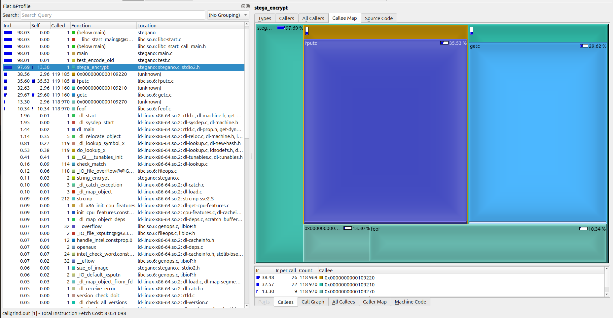

# Machine de test

- Architecture : Intel x86_64
- CPU : i7-1165G7 8-core @ 4.7 GHz
  - Cache L1d : 192 KiB
  - Cache L1d : 128 KiB
  - Cache L2 : 5 MiB
  - Cache L3 : 12 MiB
- OS: Ubuntu 24.04

# Introduction

Le projet choisi est celui qui était parmi la liste proposée : `Steganography-in-C`. C'est un programme permettant d'effectuer de la stéganographie sur des images. 

La stéganographie est l'art de dissimuler de l'information discrètement dans un média (signal audio, image, vidéo, etc.). En l'occurrence le programme utilise une technique permettant de dissimuler des informations textuelles dans une image. 

La technique utilisée est la suivante : on utilise les bits de poids faibles (LSB) des pixels qui constituent l'image, dans le cas du programme au format Bitmap.

L'algorithme est le suivant : nous voulons encoder la lettre `A` (0x41, 0b01000001) dans une image quelconque. nous utilisons 8 pixels consécutifs sur lequel pour chacun des pixels, on encode la valeur dans le LSB.

Voici un exemple où l'on considère qu'un pixel est un triplet de 0 et de 1 :

\begin{table}[h]
    \centering
    \begin{tabular}{|c|c|c|}
    000 & 010 & 110 \\  \hline
    000 & 111 & 000 \\  \hline
    110 & 100 & 000 
    \end{tabular}
    \caption{Image d'exemple}
\end{table}

On souhaite encoder 0x41 dans l'image, on peut le faire de la manière suivante : 

\begin{table}[h]
    \centering
    \begin{tabular}{|c|c|c|}
    00\textbf{0} & 01\textbf{1} & 11\textbf{0} \\  \hline
    00\textbf{0} & 11\textbf{0} & 00\textbf{0} \\  \hline
    11\textbf{0} & 10\textbf{1} & 000 
    \end{tabular}
    \caption{Image d'exemple avec 0x41 encodé}
\end{table}

Concernant le programme, celui-ci a nécessité quelques modifications pour le rendre fonctionnel, j'ai réorganisé les fichiers et le code et mis en place un Makefile.

En effet, initialement celui-ci séparait l'opération d'encodage et de décodage dans deux fichiers .c et ceux-ci étaient directement inclus dans un fichier principal.

J'ai mis en place un header et rassemblé tout le code source sous un seul même fichier C.

Baseline : pour le profiling et le benchmarking, je me suis concentré sur la partie d'encodage (c'est-à-dire la partie permettant de dissimuler de l'information dans une image). Afin d'effectuer les tests, j'ai ajouté une fonction permettant de lancer une opération d'encodage sans utiliser des inputs utilisateurs.

# Analyse

Avant même de lancer le programme, en analysant le code source de l'application on constate que le programme utilise beaucoup de fonctions d'entrée et de sortie. En effet, l'auteur du programme utilise un stratagème pour ne pas utiliser d'allocation dynamique de mémoire, il utilise des fichiers, entre autre pour stocker le message secret qui sera dissimulé dans l'image.

On peut déjà deviner que le principal bottleneck de l'application sera les opérations IO. 

## Profiling

Afin d'identifier les appels fréquents on utilise callgrind. En lançant le programme avec celui-ci :

```sh
$ valgrind --tool=cachegrind ./stegano -testb # test avant optimisation
```



On constate que les fonctions `fputc`, `fgetc` et `feof` sont les plus appelées. C'est attendu étant donné que chaque encodage est effectué caractère par caractère et qu'aucun buffer intermédiaire n'est utilisé.

On peut également effectuer une analyse avec `perf` : 

Résultat de `perf stat`

```sh
 Performance counter stats for './stegano -testb':
              1.94 msec task-clock                       #    0.892 CPUs utilized
                 0      context-switches                 #    0.000 /sec
                 0      cpu-migrations                   #    0.000 /sec
                64      page-faults                      #   32.951 K/sec
         4,873,180      cycles                           #    2.509 GHz
         9,657,340      instructions                     #    1.98  insn per cycle
         2,106,315      branches                         #    1.084 G/sec
             9,634      branch-misses                    #    0.46% of all branches
                        TopdownL1                 #      8.5 %  tma_backend_bound
                                                  #      5.3 %  tma_bad_speculation
                                                  #     29.3 %  tma_frontend_bound
                                                  #     56.9 %  tma_retiring
       0.002177210 seconds time elapsed
       0.002227000 seconds user
       0.000000000 seconds sys
```

## Proposition d'amélioration

Le programme est au final assez simple, toutefois on peut clairement se passer de toutes ses opérations IO, ce que j'ai donc fait : j'ai réécrit tout la fonction permettant d'encoder un message dans une image mais en utilisant cette fois-ci un buffer contenant toute l'image originale. Toutes les modifications sont effectuées directement dessus au lieu comme auparavant de traiter un caractère à la fois en utilisant les fonctions d'IO.

D'un point de vue temps de traitement on y gagne énormément puisque les fonctions IO sont bloquantes et impliquent des context-switchs ce qui ralentit les performances entre autres.

Voici les résultats obtenus avec `hyperfine` :

```sh
$ hyperfine --warmup 10 -N './stegano -testa' './stegano -testb'

Benchmark 1: ./stegano -testa
  Time (mean ± σ):     313.1 µs ±  66.9 µs    [User: 215.8 µs, System: 71.1 µs]
  Range (min … max):   237.5 µs … 1115.9 µs    2697 runs

Benchmark 2: ./stegano -testb
  Time (mean ± σ):     986.2 µs ± 263.0 µs    [User: 556.0 µs, System: 377.5 µs]
  Range (min … max):   853.7 µs … 9679.9 µs    3085 runs

Summary
  ./stegano -testa ran
    3.15 ± 1.08 times faster than ./stegano -testb
```

La version `-testa` est la version avec notre buffer dynamique, `-testb` est la version classique, on voit que simplement en retirant les appels à `fputc`, `fgetc` et `feof`, le programme est en moyenne 3 fois plus rapides.