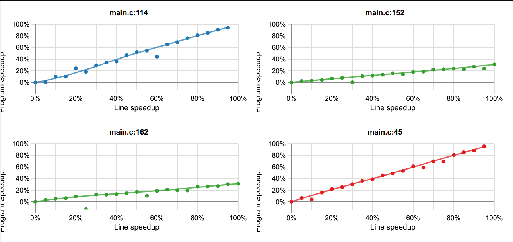

# Machine de test

Machine utilisée pour les tests :

- Architecture : Intel x86_64
- CPU : i9-9900K 8 Cores / 16 Threads @ 3.60GHz / Turbo @ 5.00GHz (CoffeeLake)
  - Cache L1 : 32 kB
  - Cache L2 : 256 kB
  - Cache L3 : 16 MB
- OS: Debian 12
- Compilateur : 
    - gcc 12.2.0
    - target: x86_64-linux-gnu
    - Flags de compilation: ` -O3 -Wall -Wextra -g -gdwarf-3`
    - Librairies: `dl`, `math`, `pthreads`, `OpenMP`

# Introduction

Ce rapport présente les résultats obtenus pour l'optimisation de recherche de séquence dans une chaîne de caractères.

# Parallélisation (`pthreads` et OpenMP)

Pour paralléliser le programme l'approche suivante a été effectuée : on découpe le fichier en $N$ chunks où $N$ est le nombre de threads, e.g. 16. Pour ces $N$ chunks, on créé $N$ threads et chacun des threads effectuera une recherche de la chaîne (même algorithme qu'initialement), c'est une approche dans laquelle le travail est réparti entre plusieurs unités au lieu d'une seule.

Ce qu'il faut considérer ici c'est que cette approche fonctionne bien pour les grandes chaînes de caractères. En effet, à moins d'avoir beaucoup de chance, dès que la séquence est trop grande, la recherche prend du temps, donc l'utilisation de plusieurs threads est intéressante (on peut dès lors négliger les context-switches entre les threads, leur créations , etc.). Pour les plus petites chaînes il est largement plus intéressant d'utiliser le programme de base, la probabilité de trouver une sous-chaîne de taille $N$ est de $\left(\frac{1}{10}\right)^N$ (distribution uniforme et chaque chiffre est indépendant les uns des autres), on voit que la probabilité décroît quand $N$ augmente.

J'ai utilisé les deux possibilités `pthreads` et OpenMP pour paralléliser le code afin d'explorer comment on pouvait utiliser les deux outils pour effectuer cette tâche. L'approche est la même dans les deux cas.

## Analyse

Pour les tests effectués j'ai utilisé `hyperfine` (avec 10 runs) pour mesurer les temps d'exécution en millisecondes et en input le premier milliard de décimales de $\pi$ (\~ 1 GB). Pour OpenMP on utilise 16 threads :

| Paramètres                | Type                 | Temps d'exécution [ms] |
|---------------------------|----------------------|------------------------|
| `111`                     | Single-threaded      | 0.5                    |
| `111 --omp`               | OpenMP               | 130.3                  |
| `111 --nthreads=16`       | Multi-threaded (16T) | 122.2                  |
| `111 --nthreads=8`        | Multi-threaded (8T)  | 124.2                  |
| `11111`                   | Single-threaded      | 0.5                    |
| `11111 --omp`             | OpenMP               | 127.9                  |
| `11111 --nthreads=16`     | Multi-threaded (16T) | 121.5                  |
| `11111 --nthreads=8`      | Multi-threaded (8T)  | 124                    |
| `1111111`                 | Single-threaded      | 14.2                   |
| `1111111 --omp`           | OpenMP               | 145.9                  |
| `1111111 --nthreads=16`   | Multi-threaded (16T) | 130.1                  |
| `1111111 --nthreads=8`    | Multi-threaded (8T)  | 137.8                  |
| `11111111`                | Single-threaded      | 463.6                  |
| `11111111 --omp`          | OpenMP               | 231.8                  |
| `11111111 --nthreads=16`  | Multi-threaded (16T) | 243.8                  |
| `11111111 --nthreads=8`   | Multi-threaded (8T)  | 291.0                  |
| `111111111`               | Single-threaded      | 2446                   |
| `111111111 --omp`         | OpenMP               | 272.3                  |
| `111111111 --nthreads=16` | Multi-threaded (16T) | 285.2                  |
| `111111111 --nthreads=8`  | Multi-threaded (8T)  | 327.7                  |

Comme on peut le voir, la version single-threadée explose les scores quand il s'agit de trouver une chaîne de moins de 7 caractères, cependant dès 7 caractères, pour une raison que j'ignore, le temps d'exécution augmente drastiquement. On remarque également l'overhead d'environ 120ms qui correspond à la création des threads pour les versions OpenMP et multi-threadées (16T et 8T) pour les petites chaînes de caractères.

Toutefois, on voit en quoi paralléliser la tâche est intéressant dès lors qu'on travaille avec des séquences de nombre plus grandes, on est 9 à 10 fois plus rapides que la version single-threadée. 

# Profiling causale avec `coz`

Dans mon code j'ai identifié potentiellement 3 sections à intéressantes à analyser (une pour chaque type) : 

- Boucle `while` dans la version single-threadée
- Boucle `for` dans la version multi-threadée
- Boucle `for` dans la version OpenMP

Afin de monter le profil, j'ai fait un script bash qui s'occupe d'appeler le programme de sorte à ce que l'exécution prenne du temps pour obtenir suffisamment de données lors du profiling.

Dans la\ Figure\ \ref{fig:coz}, on constate que pour les boucles en version multi-threadée (`main.c:114` et `main.c:45`), la progression est linéaire. En effet c'est ce qui est attendu, le temps d'exécution est linéaire selon la taille du fichier et quasiment aucun overhead n'est à signalé dans ces deux parties, ainsi il est attendu de voir que le program speedup obtenable dépende quasiment uniquement du nombres de bytes à traiter (i.e. la taille du fichier).

Concernant la version single-threadée (`main.c:162` et `main.c:152`), cela est moins vrai, on doit prendre en compte également des opérations bloquantes IO, ce qui limite fortement la capacité à pouvoir gagner en performances.